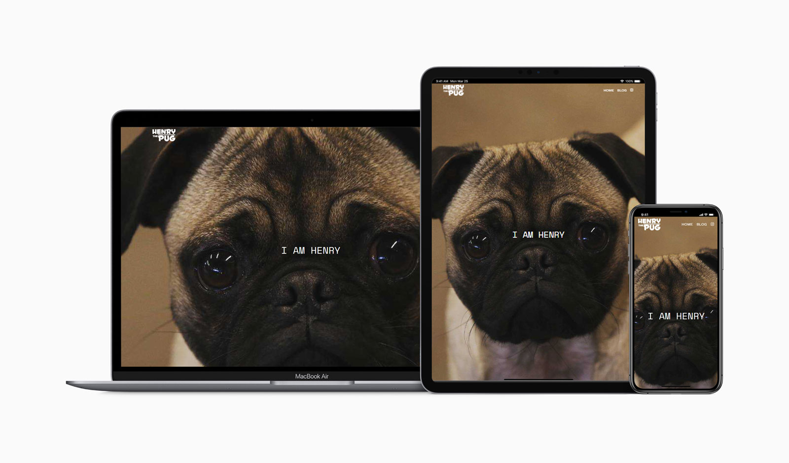

<!-- AUTO-GENERATED-CONTENT:START (STARTER) -->

  

# Henry the Pug

> A photo blog for my pug, Henry. Powered by Gatsby and WordPress.

I built this site for my dog Henry. Originally built in 2016 using WordPress and the Instagram API, as a photo blog to store some photos and watch how much he grew.
This time around I wanted something different. So I built it using WordPress as a headless CMS for the back-end and used Gatsby for the front-end. It's blazing fast.
I kept the site design pretty muc hthe same, It's still powered by the Instagram API, just swapped the tech stack.

Posts get created by a cron job and script on the server. The cron job check Instagram twice a day. If there's a new post it will create a WordPress post and attach
the media to it. The post creation triggers a web hook that then triggers a new site build on Gatsby Cloud.
